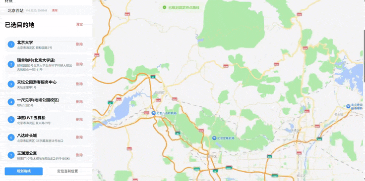

# 聚焦智能多景点旅行规划 Agent 系统
## 效果演示

> 端到端演示：输入旅行需求后，系统通过 LangGraph 多子 Agent 协作完成行程规划、酒店 / 餐饮推荐与高德地图路线展示。


> 一个面向多景点旅行规划的 AI Agent 系统：基于 LangGraph 编排多子 Agent，完成行程排序与分天规划、酒店 / 餐饮推荐、地图路线规划与评论检索，并提供 Vue3 可视化前端与 FastAPI 后端，支持 Docker 一键部署。

## 目录

- [1. 功能特性](#1-功能特性)
- [2. 技术栈](#2-技术栈)
- [3. 目录结构](#3-目录结构)
- [4. 环境要求](#4-环境要求)
- [5. 快速开始](#5-快速开始)
  - [5.1 配置环境变量](#51-配置环境变量)
  - [5.2 启动后端](#52-启动后端)
  - [5.3 启动前端](#53-启动前端)
  - [5.4 后端直接托管前端页面](#54-后端直接托管前端页面)
- [6. Docker Compose 一键部署](#6-docker-compose-一键部署)
- [7. 环境变量说明](#7-环境变量说明)
- [8. 常用接口](#8-常用接口)
- [9. 测试](#9-测试)
- [10. 备注与后续规划](#10-备注与后续规划)
- [11. License](#11-license)

## 1. 功能特性

- **行程规划 Agent**：基于 LangGraph 编排，自动完成多景点排序、分天规划与偏好权衡（省时 / 省力 / 性价比等）。
- **酒店 / 餐饮推荐**：结合 POI 知识与评论数据，给出目的地周边的住宿与餐饮建议。
- **地图与路线规划**：集成高德地图 API，提供地理编码、路径规划与可视化展示。
- **评论检索（RAG）**：政策类问答基于 OpenAI Embeddings + numpy 向量检索（`tools/retriever_vector.py`）；POI / 评论类检索基于 Chroma 向量库（`app/services/knowledge/vector_store.py`），支持按目的地增量补充。
- **航班数据查询**：内置航班 / 机场本地数据库，提供查询接口。
- **可视化前端**：Vue3 + Vite + Element Plus 构建的对话式规划界面。
- **可观测性**：统一日志、健康检查、定时任务（APScheduler）。

## 2. 技术栈

| 层 | 技术 |
| --- | --- |
| 后端 | FastAPI + Uvicorn |
| Agent 编排 | LangGraph / LangChain |
| 向量库 | Chroma |
| 前端 | Vue 3 + Vite + Element Plus + Pinia + Vue Router |
| 数据 | SQLAlchemy（SQLite / PostgreSQL） |
| 调度 | APScheduler |
| 部署 | Docker / Docker Compose |

## 3. 目录结构

```text
trip_assistant_L/
├─ app/                      # 后端主工程
│  ├─ api/                   # 接口层（routers 与各路由实现）
│  ├─ core/                  # 配置（config）、日志（logging）
│  ├─ db/                    # 数据库连接与初始化
│  ├─ graph/                 # LangGraph 编排入口（engine / agents 等）
│  ├─ models/                # ORM 模型
│  ├─ schemas/               # Pydantic 请求/响应模型
│  ├─ services/              # 业务服务（含调度 scheduler）
│  └─ tools/                 # 工具封装（图状态等辅助）
├─ graph_chat/               # LangGraph 子图 / Agent 定义与调试脚本
├─ tools/                    # 各类外部工具封装
│  ├─ amap_tools.py          # 高德地图（地理编码 / 路径规划）
│  ├─ flights_tools.py       # 航班查询
│  ├─ hotels_tools.py        # 酒店推荐
│  ├─ reviews_tools.py       # 评论检索
│  ├─ route_planner.py       # 路线规划
│  ├─ weather_tools.py       # 天气查询
│  └─ ...                    # 车辆、位置转换、向量检索等
├─ frontend/                 # Vue3 + Vite + Element Plus 前端
│  ├─ src/                   # 源码（views / components / api ...）
│  └─ dist/                  # 构建产物（被 .gitignore 忽略）
├─ api/                      # 兼容旧版接口层
├─ db/                       # 数据库连接辅助
├─ config/                   # 配置（yml / py）
├─ tests/                    # pytest 测试
├─ utils/                    # 通用工具
├─ main.py                   # 后端启动入口（自动构建并托管前端）
├─ run.ps1                   # Windows 一键启动脚本
├─ docker-compose.yml        # 容器编排（backend / frontend / chroma / postgres）
├─ Dockerfile                # 后端镜像
├─ requirements.txt          # Python 依赖
└─ .env.example              # 环境变量模板（提交到仓库）
```

## 4. 环境要求

- Python 3.11+
- Node.js 20+
- Docker / Docker Compose（可选，用于容器化部署）

## 5. 快速开始

### 5.1 配置环境变量

项目密钥通过根目录 `.env` 读取（已被 `.gitignore` 忽略，**请勿提交真实密钥**）。
请先复制模板并填入你自己的 Key：

```bash
cp .env.example .env
# 然后编辑 .env，填入 OPENAI_API_KEY / 高德 Key 等
```

### 5.2 启动后端

```bash
pip install -r requirements.txt
python main.py
```

后端启动后：

- 接口文档（Swagger）：`http://127.0.0.1:8000/docs`
- 健康检查：`http://127.0.0.1:8000/health`
- 前端页面（若已构建）：`http://127.0.0.1:8000/ui`

> 注：`main.py` 启动时会自动检测 `frontend/dist`，若不存在会尝试执行一次 `npm run build`；再打开 `/ui` 即可看到页面。

### 5.3 启动前端

```bash
cd frontend
npm install
npm run dev
```

前端开发服务默认访问：`http://127.0.0.1:5173`（或 `3000`，视 `vite.config.js` 而定）。

### 5.4 后端直接托管前端页面

若不想单独起前端开发服务器，可先构建再由后端直接展示：

```bash
cd frontend
npm run build
cd ..
python main.py
```

说明：

- `main.py` 会自动检测 `frontend/dist`。
- 存在 `dist` 时，根路径 `/` 会重定向到 `/ui` 返回前端页面。
- 不存在 `dist` 时，`/ui` 显示提示页，并给出 `/docs` 入口。

## 6. Docker Compose 一键部署

```bash
docker compose up --build
```

启动后：

- 后端：`http://127.0.0.1:8000`
- 前端：`http://127.0.0.1:3000`
- Chroma：`http://127.0.0.1:8001`
- PostgreSQL：`127.0.0.1:5432`

> 容器通过 `env_file: .env` 读取环境变量；数据库与向量库持久化目录（`.db`、`*.sqlite`、`chroma_db/`）已被 `.gitignore` 忽略。

## 7. 环境变量说明

根目录 `.env` 支持的变量（详见 `.env.example`）：

### 后端（FastAPI 读取，见 `app/core/config.py`）

```env
# OpenAI 兼容大模型
OPENAI_API_KEY=你的OpenAI/兼容服务Key
OPENAI_BASE_URL=https://api.openai.com/v1
OPENAI_MODEL=gpt-4o-mini

# 高德地图
AMAP_WEB_KEY=你的高德Web服务Key
AMAP_JS_KEY=你的高德JS地图Key

# 数据库 / 向量库
DATABASE_URL=sqlite:///./system.db
CHROMA_PERSIST_DIR=./chroma_db

# 鉴权（JWT）
SECRET_KEY=请替换为随机字符串
```

### 前端（Vite 读取，用于高德 JS 地图）

```env
VITE_AMAP_JS_API_KEY=你的高德JS地图Key
```

> 说明：`AMAP_WEB_KEY` 用于后端 Python 调用高德 Web 服务接口（地理编码 / 路径规划）；`AMAP_JS_KEY` 与 `VITE_AMAP_JS_API_KEY` 用于前端高德 JS 地图组件。

## 8. 常用接口

所有接口前缀为 `/api`：

- `POST /api/travel/plan`：生成行程
- `GET /api/travel/plan/demo`：示例行程（外滩 / 豫园 / 东方明珠）
- `POST /api/auth/register`：注册
- `POST /api/auth/login`：登录
- `GET /api/knowledge/pois`：POI 示例
- `GET /api/knowledge/hotels`：酒店示例
- `GET /api/knowledge/restaurants`：餐饮示例
- `GET /api/knowledge/reviews`：评论示例
- 其余：`/api/graph`、`/api/chat`、`/api/maps`、`/api/crawl`、`/api/config` 等模块

完整接口列表见运行后的 `http://127.0.0.1:8000/docs`。

## 9. 测试

```bash
pytest -q tests
```

## 10. 备注与后续规划

当前代码已实现：

- 行程规划主流程（LangGraph 编排，多子 Agent 协作：航班 / 酒店 / 游览预订子图，见 `graph_chat/build_child_graph.py`）
- 航班库结构（`tools/flights_tools.py` 本地航班 / 机场数据库）
- 评论 RAG：政策类问答基于 `tools/retriever_vector.py`（OpenAI Embeddings + numpy 向量检索）；POI / 评论类检索基于 Chroma 向量库（`app/services/knowledge/vector_store.py`）
- 高德地图真实路线规划（`tools/route_planner.py`：地理编码 / 路径规划，并发请求 + 连接池复用）
- 智能助手问答双流 SSE 流式输出（`app/services/langgraph_chat.py`）
- 定时任务入口（APScheduler，`app/services/scheduler.py`）
- 前后端分离结构

后续可继续完善：

- 按目的地触发自动爬取并同步向量库（`app/services/knowledge/crawler_service.py` 已预留入口）
- 更细粒度的多子 Agent 工具路由与降级策略
- 前端 `/ui` 体验与地图可视化增强

## 11. License

本项目仅供学习与研究使用。
